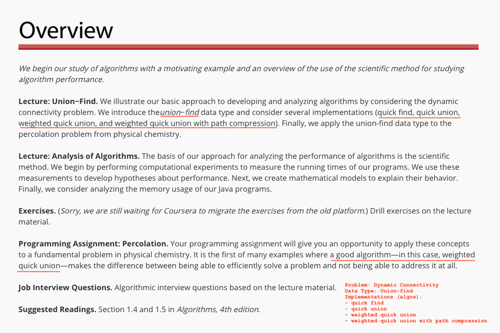

-----

## Summary: Union-Find
1. Dynamic Connectivity problem
2. Quick Find (eager approach algorithm)
3. Quick Union
4. Quick-Union Improvements
5. Quick-Find Applications

-----

### Steps to developing a usable algorithm:
1. Model the the problem.
2. Find an algorithm to solve it.
3. Fast enough? Fits in memory?
4. If not, figure out why.
5. Find a way to address the problem.
6. Iterate until satisfied.

-----

### 1. Dynamic Connectivity Problem
  * Given a set of N objects
    * Union Command: connect two objects
    * Find/connected query: is there a path connecting the two objects?

  -----

### 2. Quick Find (eager approach algorithm)
  * Quick to find, but slow to union -- O(N^2). Becomes too slow overall for huge problems.)

  -----

### 3. Quick Union (lazy approach algorithm)
  * Union should be faster, but still could be just as slow in worst case scenarios.
    * Trees can also get too tall from union, which makes find way too expensive.

  -----

### 4. Quick-Union Improvements
  * Use "Weighted Quick-Union"
    * By size or by height
    * Modify quick-union to avoid tall/large trees
  * *Even* better, use Weighted Quick-Union with Path compression
    * Just after computing root of p, set the id of each examined node to point to that root
    * Reduces time from 30 years to 6 seconds!

 -----

### 5. Quick-Find Applications
  * Percolation, Games (Go, Hex), Dynamic Connectivity, Image processing, etc.
  
-----

## Analysis of Algorithms

#### Suggested Reading
Section 1.4 and 1.5 in Algorithms, 4th edition.