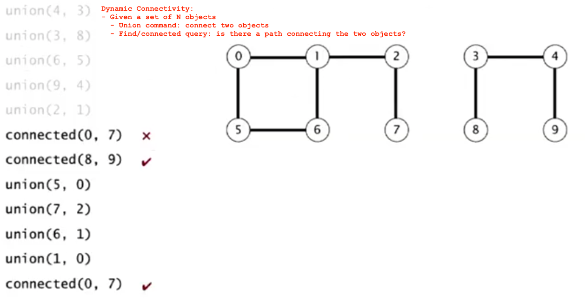
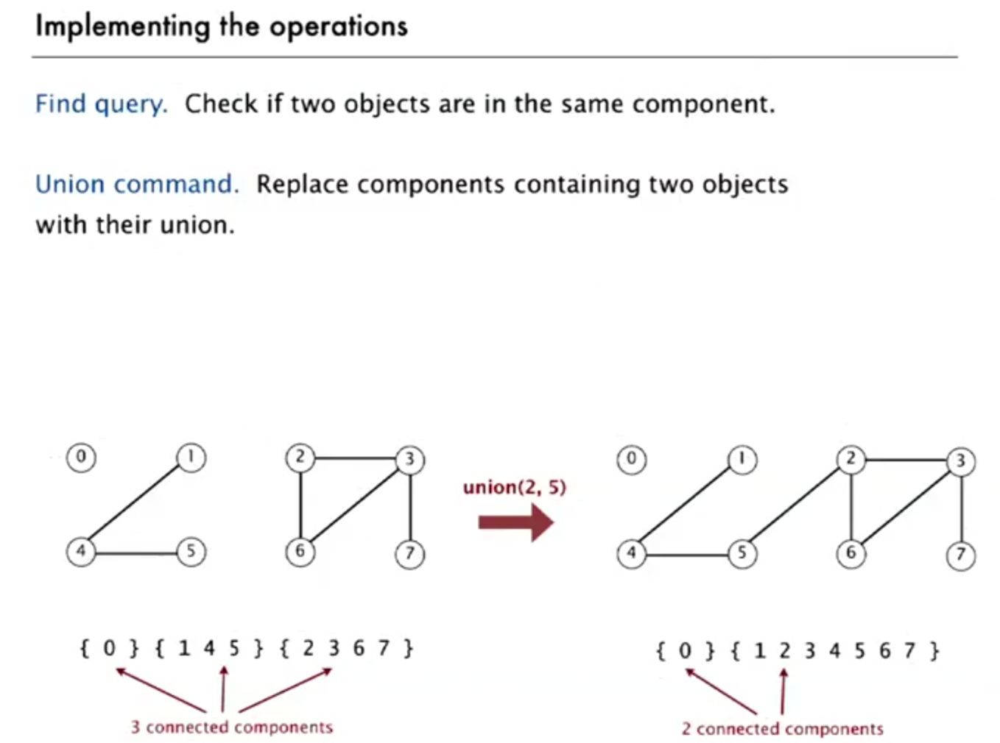
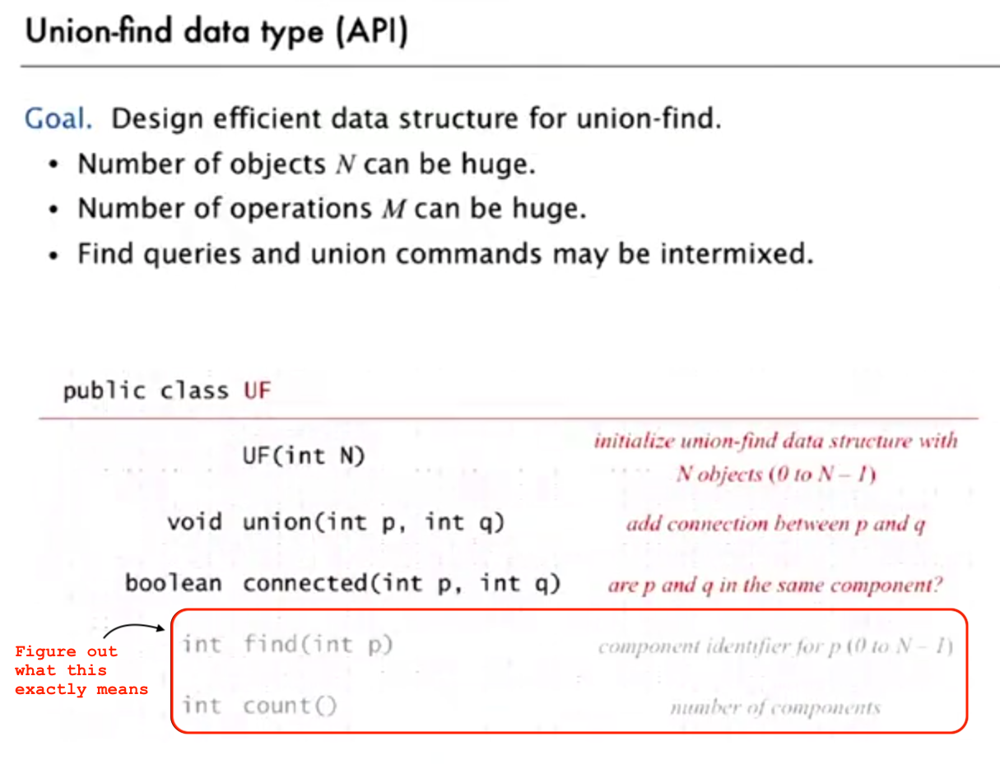
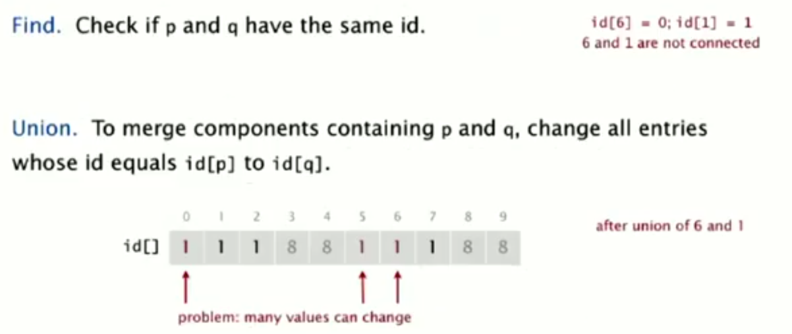
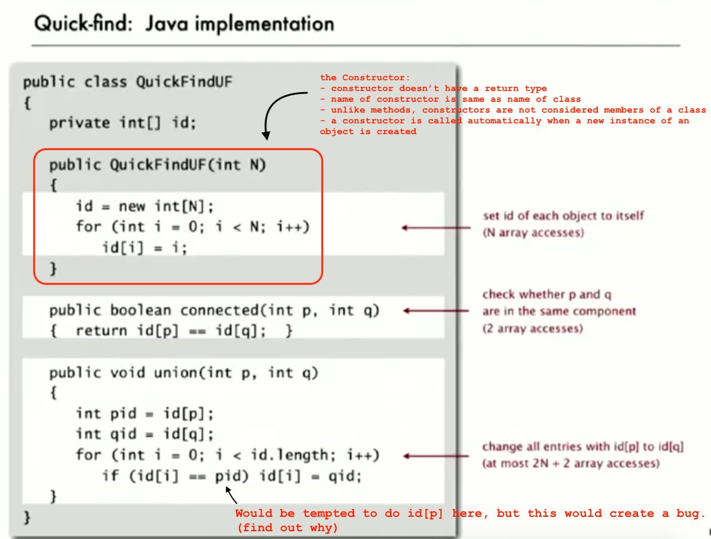
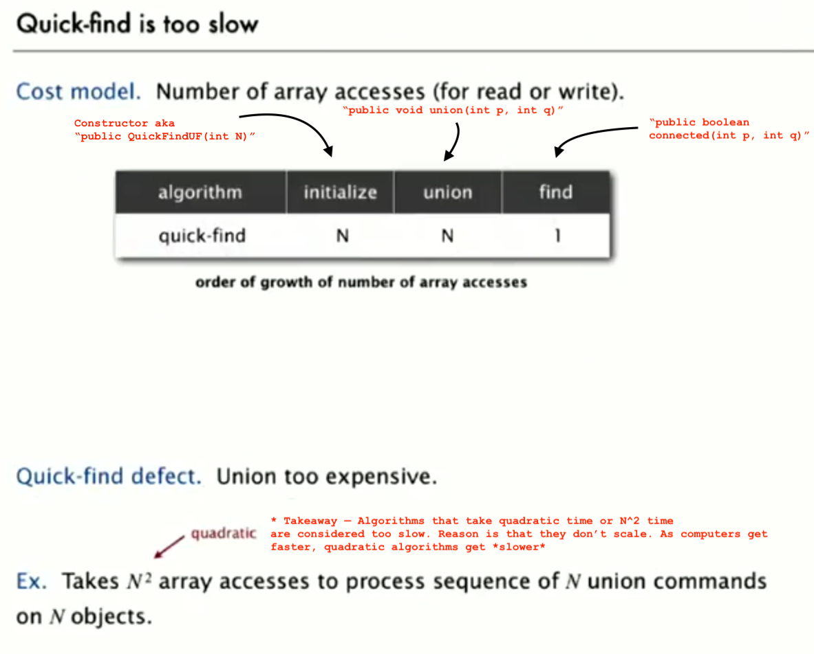
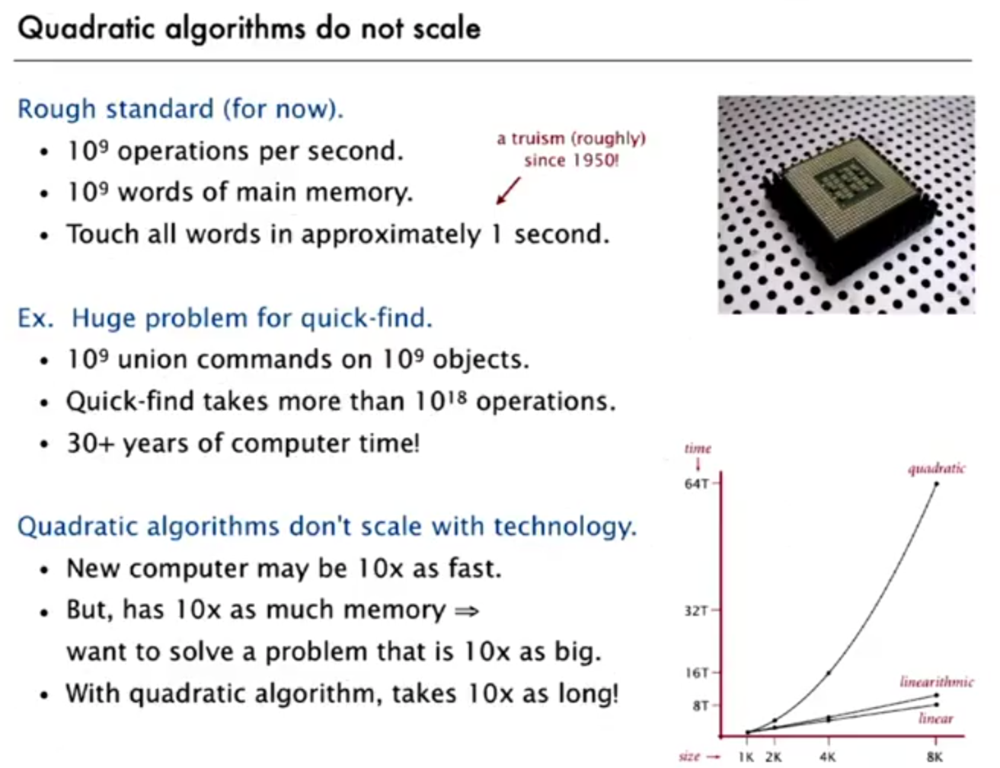

### Steps to developing a usable algorithm:
1. Model the the problem.
1. Find an algorithm to solve it.
1. Fast enough? Fits in memory?
1. If not, figure out why.
1. Find a way to address the problem.
1. Iterate until satisfied.

-----

## Summary: Union-Find
1. Dynamic Connectivity problem
1. Quick Find (eager approach algorithm)
1. Quick Union
1. Improvements
1. Applications

-----

### 1. Dynamic Connectivity Problem
  
  
  
  

### 2. Quick Find (eager approach algorithm)
  
  
  
  
  

-----

## Analysis of Algorithms

#### Suggested Reading
Section 1.4 and 1.5 in Algorithms, 4th edition.